<!--
author:   Linda C. Mitchell, Ph.D

email:    LiaScript@web.de

version:  0.0.1

language: en

narrator: US English Female

comment:  The Glyfada Method is a formula to help you write essays by focusing on the most difficult part of an assignment—getting started. This method helps you, the writer, discover what your main points are and what you have to say about each main point.

logo:     ../cover.jpg

tags:      english, writing, composition

-->

# The Glyfada Method

> This document was automatically translated to LiaScript from
>
> https://www.ck12.org/book/the-glyfada-method/

## 1.0 The Glyfada Method: A Writing Process

<article>

</article>

### 1.1 The Glyfada Method: A Writing Process

<article>

Foreword for Teachers
---------------------

I. Invention as an Approach to Teaching Writing

For many decades students were expected to make an outline with an introduction, a body, and a conclusion. Although they were not sure what they wanted to say, they made the outline and wrote the essay to fit it. Sometimes reversing the process, they wrote the paper and then made an outline from the finished product. After marking the essays for correctness in spelling, mechanics, grammar, thesis, development, and organization, teachers returned papers to students who, in turn, stuffed them in notebooks or book bags. However, during the last twenty years, writing instructors have updated their pedagogy by focusing less on the composed product and more on the composing process.

In the on-going teaching of writing, some English teachers work from the whole to the part. They start with the whole paper by teaching outlining, organization, thesis, purpose, introduction, body, and conclusion. Then, as the semester goes on, they move into the smaller parts such as sentence structure, diction, and grammar. James L. Kinneavy found “much evidence that beginning with the whole and moving only incidentally to the parts (mechanical skills of punctuation, spelling, sentence skills, paragraph skills) does not seem to be entirely successful” (1). Other teachers prefer to work from the part to the whole, starting with perhaps a grammar unit before teaching the whole paper even though seventy years of research “demonstrate overwhelmingly that the isolated teaching of grammatical skills has little or no transfer to use in actual composition” (1). Essays are assigned and graded, while teaching focuses on general rules either starting with the whole and moving to the parts or vice versa. The connection between the teaching and the writing is not emphasized.

Whether a teacher starts with whole concept of composition and works to the parts (paragraph development, sentence structure, grammar, and punctuation) or reverses the procedure, the end result is the same: more time is spend evaluating the finished product than working through prewriting, drafting, and revising. Teaching and grading are both analytical skills; the student, though, is trying to learn generative skills. The proportion of class time and teacher time spent on the various stages might look something like this:

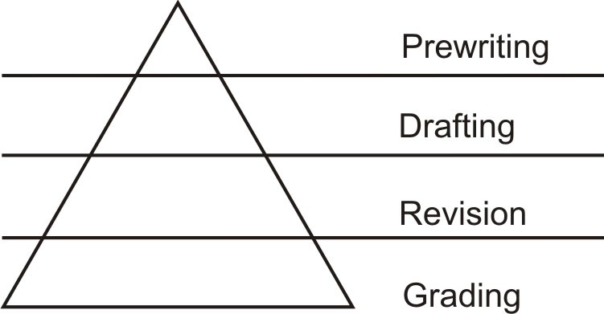

Instructors have finally begun to realize that teaching occurs during prewriting, drafting, and revising, and the most effective test is the student’s own evolving manuscript. Teaching occurs effectively at any but the last step because grading is not teaching. When the student reaches the evaluation stage, the teacher serves as a judge. The real work has already been done during the stages of training and refining the presentation. Over the past two decades, the proportion of class time and teacher time spent on composition has gradually been inverted to look like this:

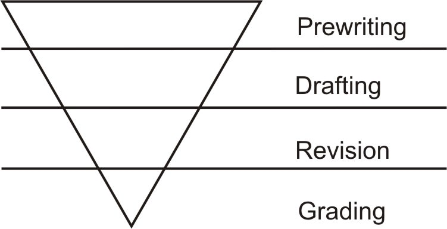

The inverted triangle shifts the emphasis from product to process because the biggest chunk of time is allotted to the most significant step, prewriting. Students cannot go astray as they collect the right ingredients for a paper and decide what to make. In the next step, organizing, students need a crutch; they have to find a recipe that will help them arrange ideas. Simply listing ideas (ingredients) does not guarantee a successful paper because students must be able to select, add, and delete. Students need to identify what ingredients are required and have a plan for combining them. A new writer needs specific directions that a recipe can provide; if he follows those directions, he will make something that is satisfying. Having a specific set of cooking instructions becomes a life line for poor writers, a benefit to average writers, and an option for the good writers. Any recipe “that cannot be practiced by teachers, writers, or students and that does not produce increasingly effective drafts of writing must be reconsidered” (Murray 12).

Twenty five ago while teaching in an American college in Glyfada (Athens), Greece, I developed a recipe that could be practiced by teachers and students and that did produce more effective drafts. This formula approach, the Glyfada Method, took the fear out of writing in an English class, giving the students both a psychological advantage and an intellectual aid. It seems to conflict with many experts of contemporary research such as James Moffett who believes formula writing kills creativity. For some students and teachers the idea of writing with a recipe is distasteful and restraining. However, one student’s restraints are another’s life lines. The Glyfada Method takes students through twelve mandatory, but flexible steps that touch on each phase of the writing process. Those steps include a listing of ideas, a statement thesis with main points, an outline with support, and required transitions and key words in each paragraph. It is neither whole to parts nor parts to whole; both of these approaches emphasize product and analysis. Instead, the Glyfada Method is a process. Writing the natural way, students accept responsibility for gathering the ingredients for their papers and following a recipe for the sequence of combining.

The Glyfada Method frees the student of the cognitive overload of dealing with structure, content, diction, spelling, and punctuation all at once, thus reducing “writer’s performance anxiety” (Flowers 44). As Pirsig suggests, when a student does not have to face all his problems at once, the writing process becomes less overwhelming. In _Zen And the Art of Motorcycle Maintenance_, when Chris has trouble starting a letter to his mother, his father gives him the following advice about writing:

I tell him getting stuck is the commonest trouble of all. Usually, I say, your mind gets stuck when you’re trying to do too many things at once. What you have to do is try not to force words to come. That just gets you more stuck. What you have to do now is separate out the things and do them one at a time. You’re trying to think of what to say and what to say first at the same time and that’s too hard. So separate them out. Just make a list of all the things you want to say in any old order. Then later we’ll figure out the right order. (Pirsig 271)

The Glyfada Method is a recipe to “separate out the things and do them one at a time.” It is a way to “make a list of all the things a writer wants to say in any old order.” Then, later he can “figure out the right order.” A student is able to concentrate on discovering ideas and organizing them before he has to worry about sentence structure, grammar, or spelling. Linda S. Flowers and John R. Hayes state

...the act of writing is best described as the act of juggling a number of simultaneous constraints (31). \[They\] suggest that one of the most effective strategies for handling this large number of constraints is Planning. Plans allow writers to reduce ‘cognitive strain,’ that is, to reduce the number of demands being made on conscious attention. (31-32)

The recipe approach will not solve the problems of awkward sentence structure, poor grammar, misspelled words, and incorrect punctuation. However, if a writer feels more secure with his organization and unity, he can afford to spend time working on other elements of writing.

Writing instructors, especially new teachers or student teachers, find that the Glyfada Method gives them confidence to teach writing. Because new teachers have not established their teaching methods and philosophies, they welcome a technique that is already set up with guidelines for success. For both new writers and new teachers, the method is similar to learning to ride a bike with training wheels. When they begin to fall, the training wheels support them and keep them steady. And, when these writers and teachers are fully confident, they can remove the training wheels and follow what works best for them.

Composition instructors want to present a plan to follow so that inexperienced writers can build their confidence. If students have a system for getting a topic, discovering ideas for it, and putting the material into an adequate form, they can be confident they will have an essay. However, if writers have no technique for getting started, they may either ramble until they get the required length, or they may not even do the assignment. The Glyfada Method will not solve all of the writing woes of teachers and students. It does not profess to increase creativity and enthusiasm among writing students. However, it will lessen some of the more frustrating problems that occur during each writing session, and students will eventually gain confidence and become coherent writers. As long as students know they have less of a chance of failing, they begin to take risks in writing. To use an analogy, although this recipe (the Glyfada Method) will not make them great chefs, they will learn how to be good cooks. The menus may not be elaborate, but they will satisfy the guests.

In developing this method during the last twenty-five years, I have formulated the following tenets:

1.  Putting the writing process into an easy-to-follow method helps students produce better essays.
2.  Each stage in the writing process contributes to a unified whole.
3.  A writer must inventory and crystallize his main points.
4.  The writing procedure can be adjusted to fit different types of discourse: expressive, persuasive, referential, or literary.
5.  Students who have a method are less likely to write their papers the night before or to borrow a roommate’s old composition.
6.  If writers have a checklist to use on their papers before turning them in, they will probably spot trouble areas in advance.
7.  Students who use this method are better peer editors.
8.  Students are better readers because the method becomes a conscious step that will, with practice, become part of them. “If he cannot abstract a thesis from what he reads, it’s not likely that he will have much success in formulating his own thesis sentence” (Corbett 49).

Whatever teaching method is used, it “should provide guidance _during the process_ if students are to acquire the art of writing” (Lauer 54). If real learning is to take place during the writing process, the instructor must not place the emphasis on product and analysis. However, when writers spend the bulk of their time on the writing process, they are learning as they are composing.

Other methods work as well, but this recipe presents another option for those teachers and students who find it compatible to their philosophies. It should _not_ be used in the classroom to the exclusion of other activities such as free writes, journal entries, and creative writing. The key to the Glyfada Method lies in giving both teacher and students a recipe that will take them through the writing process. By reducing the “cognitive strain,” that is, the necessity of juggling all aspects of the composing process, and focusing on one or two important aspects of writing at a time, the teacher and the students are not overwhelmed by a method that seems unapproachable (Flowers 40). Students are able to generate text by expressing their thoughts in the appropriately grammatical form versus analyzing a sentence for its grammaticality. Not only do teachers have an almost fail proof method for the classroom, but students also gain confidence in their own writing performance. Knowing that they have training wheels, students can concentrate on the process instead of the product.

II. Research on Invention in the Classroom

Invention refers to all mental activity preceding transcription. Once concerned with argumentation only, it is now used in all modes of writing. It “usually begins with identifying the crucial issue to be argued (a question of fact, definition, quality, or procedure)” (Young 36). With renewed interest in invention, writing instructors who have reevaluated their teaching methods in order “to provide effective instruction in....the ‘prewriting stage’ of the composing process and in the analytical and synthetic skills necessary for good thinking” (Young 33). Authors of writing texts come up with a variety of “schemes, lists, matrices, patterns, devices, and questions to stimulate the capacities writers already have for finding topics and ideas” (Ruszkiewicz 80). No one system offers the final solution to getting students to come up with topics and ideas. Rather, what works for the instructor seems to be the best approach.

In particular, four shifts in forms of invention used to teach composition have been prominent. The moving away from the composed product (i.e. the finished manuscript) to the composing process reflects the reemergence of invention (or heuristics) as part of the writing process. The first approach is classical invention. Classical rhetoric is the art of constructing persuasive arguments in five stages: invention, arrangement, style, memory, and delivery. In the first stage of the writing process, invention, the student discovers valid arguments by examining the issue at hand. The first kind of argument, non-artistic or non-technical proof (laws, witnesses, contracts, tortures, oaths) did not have to be _invented_ because it was not part of rhetoric. In other words, the form and content were determined in advance, and no methods of discovering ideas were needed. However, the second kind, artistic proof, fell under rhetoric: rational appeal (logos), emotional appeal (_pathos_), and ethical appeal (_ethos_). Classical rhetoricians devised topics (_topoi_) as an aid in discovering ideas for the three modes of appeal. In rhetoric, “a topic was a place or store or thesaurus to which one resorted...it was a general head or line of argument which suggested material from which proofs could be made...a way of probing one’s subject...to discover possible ways of developing that subject” (Corbett 35). The first two stages of writing, invention and arrangement, have been particularly influential in that they are a means of discovering ideas and arranging them. It is a method of prewriting that is essential to the writing process.

A second approach to invention is Kenneth Burke’s dramatistic method, a “pentad of heuristic probes--act, scene, agent, agency, and purpose--for analyzing human motives and motifs in human experience, which broadly construed, include virtually everything we think and do” (Young 37). Burke (1955) states: “Any complete statement about motives will offer _some kind_ of answers to these five questions: what was done (act), when or where it was done (scene), who did it (agent), how he did it (agency), and why (purpose)” (Young 37). Classical rhetoric and the dramatistic method are both similar and dissimilar: “The classical topics are aids in discovering possible arguments; the pentad is an aid in discovering the essential features of the behavior of groups or individuals” (Young 37). Instead of probing a topic for ideas, the pentad becomes a means of analyzing _“language behavior”_ (Young 37). The who, what, when, where, how, why is a reporting approach, whereas the classical probing of a topic is designed to discover valid arguments of the issues. However, both approaches serve the purpose of getting information for development of a specific purpose.

In a third approach, D. Gordon Rohman’s prewriting method is to “develop the creative potential of the writer in dealing with his or her own experience” (Young 37). “’To what end do we teach writing?’ Rohman (1965) asks”:

If it is to ‘program’ students to produce ‘Letters and Reports for All Occasions,’ it is not only ignoble but impossible....However, if it is to enlighten them concerning the powers of creative discovery within them, then it is both a liberal discipline and a possible writing program...What we must do is place the principle of actualizing in the minds of students and the methods of imitating it in their hands. (Young 37)

In order to introduce students to methods of creation and to help them “assimilate their subject to themselves,” Rohman uses a procedure he has developed from interests in Thoreau and in theoretical and applied work on creativity and concept formation (Jerome Bruner. 1965; William Gordon, 1961; Arthur Koestler, 1964)” (Young 37). In practical application he has students “keep a journal, practice principles derived from religious meditation, and employ analogy as the primary instrument for probing experience” (Young 38). This method may work well as a means of self-discovery, but it drifts from concentration on discovering ideas on a subject in classical invention. Rohman’s approach is the most contrary to the Glyfada Method. His emphasis is on creative writing and spontaneity, not on a formulaic approach that has steps to follow.

Four, another method of invention is derived from tagmemics, a linguistic theory developed by Kenneth Pike. “Since composing is but a specialized use of language, Pike argues, a theory about language behavior in general should also be applicable to composing behavior” (Young 38). In developing an art of invention, he set up a series of “heuristic procedures designed to aid the process of inquiry...it provides procedures for analyzing and formulating problems, for exploring problematic data in search of solutions, and for testing solutions” (Young 38). It also provides techniques for predetermining the basis of psychological change in an audience. Pike’s tagmemic method purports to do three things for the writer in dealing with experiencial material: “retrieval of relevant information already known, analysis of problematic data, and discovery of new concepts and ordering principles” (Young 39). Pike’s tagmemic’s invention differs from classical rhetoric and prewriting. Classical rhetoric concentrates on discovering arguments and bringing about a psychological change in the audience. Prewriting allows an ordering of principles and the appropriate changes in the writer. However, tagmemic invention is concerned with systems, processes, styles, and approaches in that it becomes a problem-solving exercise. It deals with the problems arising from one’s own experiences and those problems generated out of a need to change other people’s ideas.

Each of the four methods of invention emphasizes a different approach for using invention to teach writing. Classical rhetoric probes the topic and discovers arguments in order to present the issues clearly and forcefully. Invention as the first of the five stages of preparing for an argument is a more structured, analytical approach. Burke’s pentad takes a journalistic approach, answering who, what, when, where, why, and how. The reporting formula used here contrasts to the classical approach used to build an argument. Rohman uses a self-discovery method of journals, meditation, and analogies. This mention of invention is a creative, free-flowing style that works well with certain types of writing. But, students need more structured approaches for essays and reports. Pike’s tagmemics incorporates the probing of the writer’s experiences in the world and his ability to use those experiences to bring about a change in his audience. This approach uses problem-solving techniques which contrast to the discovering of crucial issues in classical invention. Regardless of the label it is interesting to note that these experts, along with thousands of other composition instructors, see a need for some prewriting activity in the invention stage in order to produce a better product. Whether it be journals, free writing, or heuristics, the emphasis has shifted from the composed product to the composing process.

In looking for a method that is appropriate for the classroom, we need to ask ourselves several questions.

1.  Does the method sound good in theory, but does it work poorly in the classroom?
2.  Does it accomplish the things it is supposed to do? Does it allow for adequate probing of a topic?
3.  Do students get frustrated in trying to use the guidelines? Does it hinder rather than help their writing?
4.  Do students begin to rely too heavily on method, thus keeping themselves from stretching their mental processes?
5.  Do students feel more positive or negative about writing? Apathetic?
6.  Does the method work with only certain kinds of writing, leaving the students and teacher to find other methods for other types of writing?

Not all approaches are compatible with all instructors. To use a computer term, the method must be user friendly in order for all to benefit from it.

Using a method of invention offers an approach that will make writing less frightening and more comprehensible. Each of the invention techniques presented above has merits that can be gleaned and used in the classroom. When we choose a method of discovery for maximum creativity and productivity, Timothy R. Donovan and Ben W. McClelland tell us to ask these questions: Is it accessible? Is it harmonious? and Is it feasible? (Donovan xii-xiii). If we can answer yes, then we will feel comfortable with that method.

III. Invention in the Classroom

“If we want students to write better, teachers in every discipline will have to insist that students write,” an activity that includes invention techniques to access ideas they have stored on a mental disc (Odell “Teaching...” 139). To teach these invention skills, we must start with a basic plan to help students identify what they want to say and a way to say it.

I am asking that we think of writing as a process of discovery, a process of exploring, a process of creating, testing, and refining hypotheses. As we teach students how to engage in this process, we increase their chances of learning and performing well in our individual subject areas (Odell “Teaching...” 140).

Invention refers to other formal methods “designed to aid in retrieving information, forming concepts, analyzing complex events, and solving certain kinds of problems” (Young 32). It usually begins with “identifying the crucial issue to be argued (a quest of fact, definition, quality, or procedure)” which helps to determine the thesis of the argument (Young 36).

For many years, invention activities in the first stages of writing had a low priority, if they existed at all. For example, in her study of the composing processes of twelfth graders, Janet Emig (1971) notes that “‘in school-sponsored writing, there is often no time provided for... \[the prewriting\] portion of the writing process’” (Young 34). Without the prewriting activities the quality of the product becomes a matter of luck. If the writer happens to pull it together with good ideas, the paper works; if he has no idea of what he wants to say, he may write a rambling, incoherent paper. The results can easily be failure and frustration; students end up hating writing because they do not know how to build a paper.

Invention _does_ make a difference in any writer’s performance. Odell verifies this assertion from his own writing experiences:

At times, the process of discovery may lead us to make major changes in our understanding of a given topic; we may no longer think or feel as we once did. More frequently, for me at least, the process of discovery entails a revision of existing structures, a heightened sense of a relationship between $X$ and $Y$, a clearer understanding of the implications of a given assumption. (“Teaching...” 143)

When we come to what seems like an impasse, we need a method to loosen ideas and let them flow freely, slowly forming a coherent picture of what we want to say. The invention method provides the impetus for good writing for many students who never thought they could fill a blank page. In giving advice to new freshman composition instructors, John J. Ruszkiewicz stresses discovery techniques as essential to teaching success: “Design a class that sparks the invention of ideas, that encourages exploration of structures and styles, that heightens students’ awareness of audience and purpose...” (80). He also states, “inexperienced writers need to be taught to probe into the recesses of any subject to discover what there is that is surprising, informative, pleasurable, or useful to a reader” (80). It is unfortunate that many instructors have never heard this advice.

Writing instructors must deal directly with the lack of inventive skills that plague inexperienced writers. In the age of prepackaged lesson plans, we must head Lucy Calkins’ warning: “After detouring around the authentic, human reasons for writing, we bury the students’ urge to write all the more with boxes, kits, and manuals full of synthetic writing-stimulants” (4). Instead of using these artificial stimulants to teach writing, we must help students understand the writing process. Understanding what happens as they go through each stage of composing eliminates anxiety and uncertainty. Students are amazed at how quickly they can fill a sheet of paper with prewriting ideas and at how the ideas build from the early stages to the final draft (Murray 3). Slowly, the unconnected words and phrases begin to build a scaffold and take on a natural order. As drafting and revision stages progress, development moves from superficial levels of planning to more sophisticated ones. What begins as a crude form develops into a solid framework that stands independently.

Invention makes discovering, arranging, and expressing material more effective. “It represents a _positive_ approach to the problems of writing” (Corbett 43). Not only is the material directed to a specific end, it “can lay down general principles that the student can adapt to fit the particular situation...it can provide the student with a set of procedures and criteria that can guide him in making strategic decisions in the composition process” (Corbett 43). Corbett recognizes the danger of working with a predetermined model: “There is no denying that formula can retard and has retarded inventiveness and creativity. But to admit that formula can inhibit the writer is not to admit that it invariably does inhibit him” (Corbett 44).

If we do not limit the possibilities, invention proves to be a valuable aid. In the 70’s Frank J. D’Angelo observed the “shift from thinking of invention as the search for ideas _before one begins to write_ to thinking of it as _an ongoing process_ that continues throughout the arrangement of those ideas (41-42). With prewriting activities now being widely used in classrooms at all grade levels, we have to avoid thinking that searching out and discovering ideas ends with planning. Composition teachers need to tell students that as the essay progresses, ideas are refined and can be either deleted or expanded. In fact, the final draft may not even resemble the ideas discovered in the preplanning stage. James Moffett’s _Teaching the Universe of Discourse_ (1968) elaborates the ideas of this continuum.

At one extreme, one talks about ‘what is happening,’ recording unselectively the phenomena that occur at the moment one speaks or writes. As one moves along Moffett’s continuum, one writes about subjects that are increasingly remote in time and space; that is, one abstracts from previous experience and reports about ‘what happened.’ Then one generalizes about recurrent phenomena, about ‘what happens.’ And finally one theorizes about ‘what will or might happen.’ (Odell “Discourse Theory” 5)

Moffett’s ideas encourage all types of spontaneous writing activities as a means of reaching the final draft. The first stages may include such assignments as journal entries, free writes, timed writings, or in-class directed essays.

Invention helps students become independent writers. A teacher can use prompts, but students have the ideas stored within themselves. Twenty years ago, in English classes the technique of invention would have put the teacher under scrutiny for not teaching writing. To tell the students they were in charge of their own writing would have caused a considerable stir. Even now, Murray speculates, “It is very hard for traditionally-trained teachers who are not writing themselves to believe that students can write without instruction from the teacher or without assignment” (14). Teachers have to experience the writing process themselves in order to understand it and help students work through the stages. Many teachers think they have to accept responsibility for the blank, crumpled pages of frustrated students. An understanding of the writing process helps students learn not only to be better writers but also to evaluate their own work. In English classes students are required to do more self-evaluating than in a traditional content course. Murray states that “As the student passes through the stages of the writing process and tries to bring the forces within the process into balance, there is a constant evaluation of the writing process” (17-18).

Works Cited

Calkins, Lucy McCormick. _The Art of Teaching Writing_. Portsmouth, New Hampshire: Heinemann Educational Books, Inc., 1986.

Corbett, Edward P. J. _Classical Rhetoric for the Modern Student_. $2^{nd}$ ed. New York: Oxford University Press, 1971.

D’Angelo, Frank J. “Paradigms as Structural Counterparts of _Topoi_.” In _Linguistics, Stylistics, and the Teaching of Composition_. Ed. Donald McQuade. 41-51.

Donovan, Timothy R. and Ben W. McClelland. In Introduction to _Eight Approaches To Teaching Composition_. Donovan and McClelland, ed. Urbana, Illinois: National Council of Teachers of English, 1980. ix-vx.

Flowers, Linda S. and John R. Hayes. “The Dynamics of Composing: Making Plans and Juggling Constraints.” _Cognitive Processes in Writing_. Hillsdale, New Jersey: Lawrence Erlbaum Associates, Publishers, 1980. 31-50.

Murray, Donald. “Writing as Process: How Writing Finds Its Own Meaning.” In _Eight Approaches To Teaching Composition_. Eds. Timothy R. Donovan and Ben W. McClelland. Urbana, Illinois: National Council of Teachers, 1980. 3-20.

Odell, Lee, Charles R. Cooper, and Cynthia Courts. “Discourse Theory: Implications for Research in Composing.” In _Research on Composing: Points of Departure_. Ed. Charles R. Cooper and Lee Odell. Urbana, Illinois: National Council of Teachers of English, 1978. 1-12.

Odell, Lee. “Teaching Writing by Teaching the Process of Discovery: An Interdisciplinary Enterprise.” In _Cognitive Processes in Writing_. Ed. Lee W. Gregg and Erwin R. Steinberg. Hillsdale, New Jersey: Lawrence Erlbaum Associates, Publishers, 1980. 139-154.

Ruszkiewicz, John J. “The Great Commandment.” In _Training the New Teacher of College Composition_. Ed. Charles W. Bridges. Urbana, Illinois: National Council of Teachers of English, 1986. 78-83.

Young, Richard E. “Paradigms and Problems: Needed Research in Rhetorical Invention.” In _Research on Composing: Points of Departure_. Ed. Charles R. Cooper and Lee Odell. Urbana, Illinois: National Council of Teachers of English, 1978. 29-47.

Learning Objectives
-------------------

* use heuristics to find a topic
* determine the focus of the essay
* identify a target audience
* inventory a topic to determine main points
* look at main points and decide on sub-points to develop paragraphs
* decide on which appeal to use: logos, pathos, ethos
* write a strong basic thesis
* know how to organize an essay
* understand the writing process (prewriting, organizing, composing, revising, and editing)
* explain, analyze, and develop ideas

The Glyfada Method: Working Smarter, Not Harder
-----------------------------------------------

The most difficult part of starting a writing assignment is choosing a topic and figuring out what you want to say about it. The Glyfada Method is an amazing tool that helps you begin a writing assignment without anxiety or dread. There is no need to stare at the blank sheet of paper and wonder what to write when you have an easier way to jump start your paper.

What Does the Term “Glyfada” Mean?
----------------------------------

The name “Glyfada” has nothing to do with writing. It comes from the suburb Glyfada, Greece, an area twenty minutes from the center of Athens. One day when I was teaching a beginning composition class at an American university in Glyfada, I started by suggesting we find a common topic and work through the composing steps together. I wanted to demonstrate how students could use my writing method. In the first step of the method, we listed subjects the class had in common. The class chose to focus on Glyfada, an attractive Greek resort town on the Aegean. We used Glyfada as an essay topic and took it through the entire writing process. Students thereafter called it the Glyfada Method.

What Can the Glyfada Method Do for You?
---------------------------------------

The Glyfada Method is a formula that guides you through writing an essay. It provides a structure for you to build a strong foundation. It focuses on the most difficult part of an assignment—getting started. You may ask if that formula restricts your creativity. The answer is no; it is the opposite. Once you have a structure, you are free to be creative. You have to know your rules (structure) to break the rules. The Glyfada Method helps you, the writer, figure out what your main points are and what you have to say about each main point.

</article>

### 1.2 The Glyfada Method

<article>

What follows is a discussion and example of each step of the Glyfada Method. Following the completed example, you will then fill in your own worksheet for your topic. When you reach the last step, you will have a completed worksheet with which you can write your own essay.

The Glyfada Method may look overwhelming, but you will find it simple as you work through the steps. It will provide the structure you need to be confident as you write your essay.

Step-by-Step Explanation of the Glyfada Method
----------------------------------------------

Step 1: Heuristics
------------------

You have an essay assignment, and you don’t have a topic. Heuristics will help you through this dilemma. Heuristics means a way of discovering ideas. You go through trial and error to find a subject for your paper. You might think of heuristics as a way of getting into something that is hard to open. Heuristics helps you think about things you can write about.

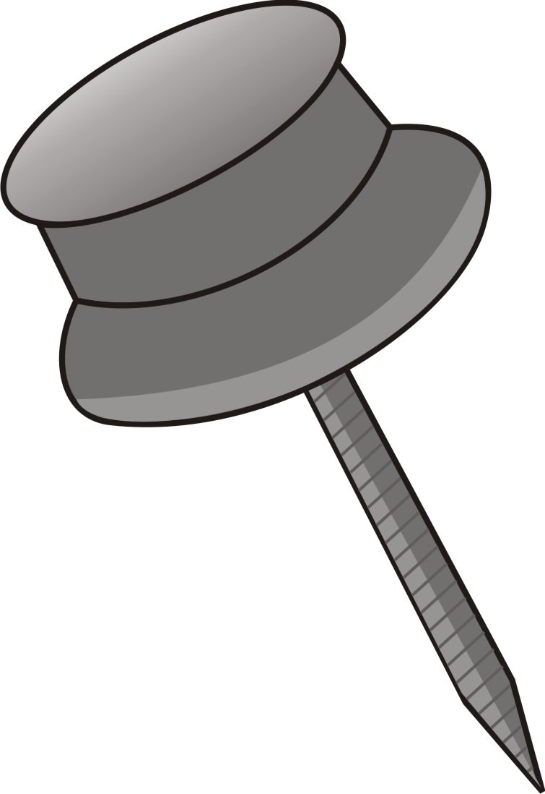

Using heuristics, the class in Glyfada came up with these topics.

Example:

**_Step 1: Heuristics/Topics_**

scuba diving, military maneuvers, deep sea fishing, culture shock, military social life, military health care, camping in Greece, travel through Germany, Greek elections, anti-American behavior, living in a foreign country, stress on families from frequent moves, and Glyfada.

Review Question
---------------

**_Step 1: Heuristics/Topics_**

\_\_\_\_\_\_\_\_\_\_\_\_\_\_\_\_\_\_\_\_\_\_\_\_\_\_\_\_\_\_\_\_\_\_\_\_\_\_\_\_\_\_

Step 2: Topic and Focus
-----------------------

Example:

**_Step 2: Topic and Focus_**

Glyfada is a good place to visit.

Review Question
---------------

**_Step 2: Topic and Focus_**

\_\_\_\_\_\_\_\_\_\_\_\_\_\_\_\_\_\_\_\_\_\_\_\_\_\_\_\_\_\_\_\_\_\_\_\_\_\_\_\_\_\_\_

Step 3: Target Audience
-----------------------

Here is a good example of choosing an audience. The class who chose the Glyfada topic was made up of young, enlisted American military members. They had to target an audience that would be interested in the topic “Glyfada.” After some thought, they decided they would pretend they were writing to their counterparts who were stationed at a military base in Germany. They would try to convince their fellow military members in cold, rainy, snowy Germany to take leave and visit them in hot, sunny Glyfada. To do that, the class would have to come up with relevant reasons why their military counterparts would take leave and travel all the way to Greece.

If the professor of that writing course had chosen an audience, it would have been her counterparts teaching for the University of Maryland European Division in Germany. The American base commander’s wife would have chosen other officer’s wives in Germany.

All three of these audiences in Germany—young enlisted military members, professors, and officer’s wives—would require a different approach to the topic. Therefore, it is very important that you know who your audience is before you decide on your approach to the topic and start gathering your supporting material.

Example:

**_Step 3: Target Audience_**

Young military members stationed in Germany

Review Question
---------------

**_Step 3: Target Audience_**

\_\_\_\_\_\_\_\_\_\_\_\_\_\_\_\_\_\_\_\_\_\_\_\_\_\_\_\_\_\_\_\_\_\_\_\_

Step 4: “So what?”
------------------

Here are a series of questions you need to consider. What is new about what you are saying? Has it been said before? Why are you saying it now? Is there a new twist? Why should people have this new information?

The class writing the essay about Glyfada asked themselves a series of “so what?” questions. They knew it would take several tries before they would come up with a good “so what?”.

Example:

**_Step 4: “So what?”_**

Come to Greece for holiday. So what? It is a fun place to visit. So what? It has many things to do. So what? Glyfada has a beautiful beach, good restaurants, a lot of entertainment, low prices, friendly people, good transportation, inexpensive hotels, and reasonably priced hotels. So what? It is easy and inexpensive to get to Greece, and one enjoys a relaxing, enjoyable vacation.

Review Question
---------------

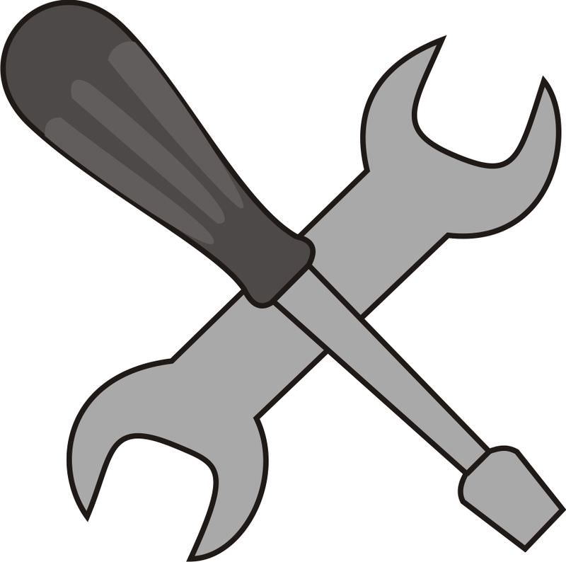

**_Step 4: “So what?”_**

\_\_\_\_\_\_\_\_\_\_\_\_\_\_\_\_\_\_\_\_\_\_\_\_\_\_\_\_\_\_\_\_\_\_\_\_\_\_\_\_\_\_\_\_\_\_\_\_

Step 5: Organization
--------------------

There are three types of organization:

a. If you want to persuade or argue, then you should use **_logical_** organization. An argument built on logic or reasoning starts with the least important major point and works to the most important major point. You can compare that rule to fireworks: start with the smaller fireworks and end with the biggest bang.

b. You might use a **_chronological_** approach. For instance, in persuading someone to visit Glyfada, you might start by describing a daily schedule of shopping early in the morning, going to the beach in the afternoon, having dinner at a local restaurant in the evening, and going to European tavernas late at night. If you wanted to put persuasive information into a story, you could incorporate it into a narrative.

c. A **_spatial_** approach means that you describe space. If you are asked to describe your bedroom, where do you start? Where do your eyes focus first? What do they move next? You would use spatial organization to describe a landscape.

When the group decided to make the essay on Glyfada persuasive, they needed to look at the kind of organization that would serve the purpose of the paper. This young American military class wanted to write a persuasive paper by starting with the weakest point and moving to the strongest point.

Example:

**_Step 5: Organization_**

Logical; persuasion; weakest to strongest points.

Review Question
---------------

**_Step 5: Organization_**

\_\_\_\_\_\_\_\_\_\_\_\_\_\_\_\_\_\_\_\_\_\_\_\_\_\_\_\_\_\_\_\_\_\_\_\_\_\_

Step 6: Appeals (Logos, Pathos, Ethos)
--------------------------------------

a. **_Logos_** is an appeal to reason. The speaker uses logic or reason to persuade.

b. **_Pathos_** is an appeal to emotions such as love, jealousy, fear, and pity.

c. **_Ethos_** is the speaker’s credibility. It is the person’s image. We believe a speaker to be trustworthy if he or she has good character, goodwill, and positive actions.

In selecting material to develop the essay on Glyfada, students had to decide how they intended to appeal to their target audience. The focused appeal would determine what support material they used. For example, students in this class were young military members, and they wanted to appeal to their counterparts in Germany. That meant choosing support that appealed to their friends in a predominately emotional manner, that is, emotions motivating the visiting military members to have a good time on their leave in Greece. Working together on development, students focused on beach fun, inexpensive local food, and trendy evening entertainment.

If the professor of the class had written the essay, the target audience and appeal would have been very different. The professor would have chosen as her target audience her counterparts at the American university in Germany. She would have appealed to logos. She would have developed the essay with examples and information about museums, historical events, literary sites, and places of Greek mythology. In contrast, the base commander’s wife would have appealed with logos and ethos about shopping areas, luxury hotels and restaurants, specialty island cruises, and specific manufacturers and their goods.

The appeal that the Glyfada topic focuses on is pathos.

Example:

**_Step 6: Appeals (Logos, Pathos, Ethos)_**

Pathos: tavernas, sandy beaches, scuba diving, sailing, beautiful girls, handsome guys, good Greek food, friendly people, good times

Review Question
---------------

**_Step 6: Appeals (Logos, Pathos, Ethos)_**

\_\_\_\_\_\_\_\_\_\_\_\_\_\_\_\_\_\_\_\_\_\_\_\_\_\_\_\_\_\_\_\_\_\_\_\_\_\_

Step 7: Development
-------------------

Always quote or paraphrase your source accurately. Your material should be current and credible. Always cite sources.

Choose showing details, not telling ones. Instead of talking about traveling in an old car, describe the rusting sides, noisy engine, and broken back window.

To write about Glyfada, students in the class decided they needed the following information.

Example:

**_Step 7: Development_**

Details about activities in Glyfada, examples of products and restaurants, definitions of European bars, and facts about prices of activities and restaurants; photos from websites or camera phones.

Review Question
---------------

**_Step 7: Development_**

\_\_\_\_\_\_\_\_\_\_\_\_\_\_\_\_\_\_\_\_\_\_\_\_\_\_\_\_\_\_\_\_\_\_\_\_\_\_

Step 8: Probable Topic
----------------------

In Step 2 of our example, students listed the subject as Glyfada on the worksheet. In Step 8, they narrowed the topic as much as possible to _Glyfada is a good place to visit_. Students in the class began to focus their topic on the reasons they thought their counterparts should visit Glyfada.

Example:

**_Step 8: Probable Topic_**

Glyfada is a reasonably priced place to visit because...

Review Question
---------------

**_Step 8: Probable Topic_**

\_\_\_\_\_\_\_\_\_\_\_\_\_\_\_\_\_\_\_\_\_\_\_\_\_\_\_\_\_\_\_\_\_\_\_\_\_\_

Once you complete Steps 1-8, you must follow the rest of the steps in order. You can go back at any point and revise, but you must follow the steps.

Step 9: Inventory
-----------------

When you do an inventory, you list (without editing) anything you can think of about your topic. You do not stop to check spelling, relevancy, or word choice. Think of it as free association—list whatever words come to mind, even though you will not use all of them.

In this class we chose a topic that students were familiar with; they knew they could think of many things about Glyfada. Once those ideas were on paper, their attention focused on the best way to organize and develop the essay. And, once those decisions were made, they had more time to spend on sentence structure, spelling, punctuation, and word choice.

Example:

The class came up with this inventory.

**_Step 9: Inventory of Topic_**

Greek food

atmosphere

boats

European bars

entertainment

souvenirs

beaches

shops

nationalities

restaurants

sidewalk cafes

street vendors

museums

wind surfing

folk dancing

cruises

scuba diving

plaka/plaza

music

clubs

tours

Review Question
---------------

**_Step 9: Inventory of Topic_**

Step 10: Reduce to Main Points
------------------------------

Some of the words listed in Step 9 are repetitious or irrelevant. In Step 10, you will play the categorizing game. You will figure out what pattern is emerging among the words and then think of three or four general categories to sort the words. These categories will become your main points. You are not restricted to your list; you can add details at any time.

Example:

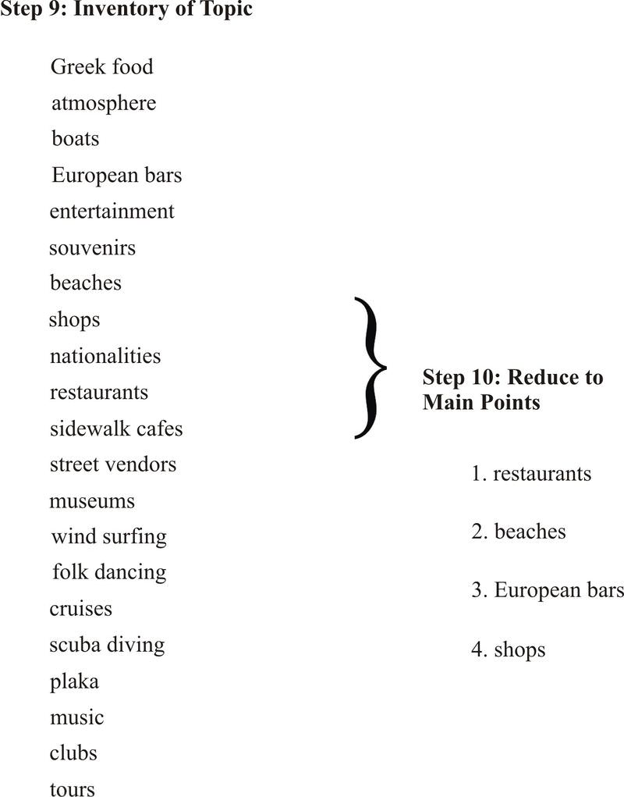

Review Question
---------------

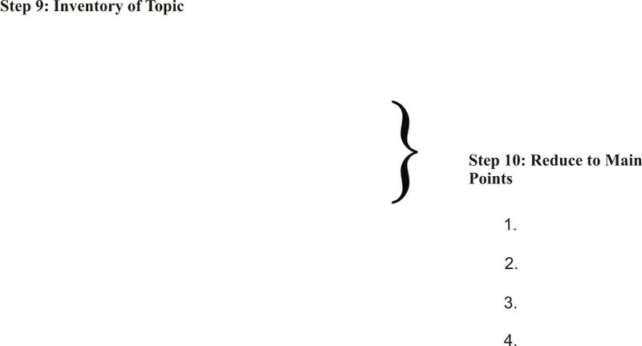
-----------------------------

When the young American military members chose their main points, they decided to arrange them according to how important they thought the places where and how often they visited the places on the list. They could have also used a spatial order by starting at a particular geographical location of Glyfada and moving to different points of interest in the resort town. Students in the class asked such questions as “Do you think trying to cover _all_ the entertainment in Glyfada _and_ Athens would be too much for your topic on Glyfada?” and “How about trying a narrative approach to your persuasion? You can work your main points into the story line.”

Example:

This example shows that the main points are in a logical order for a persuasion essay. That means starting with the weakest main point and moving to strongest one.

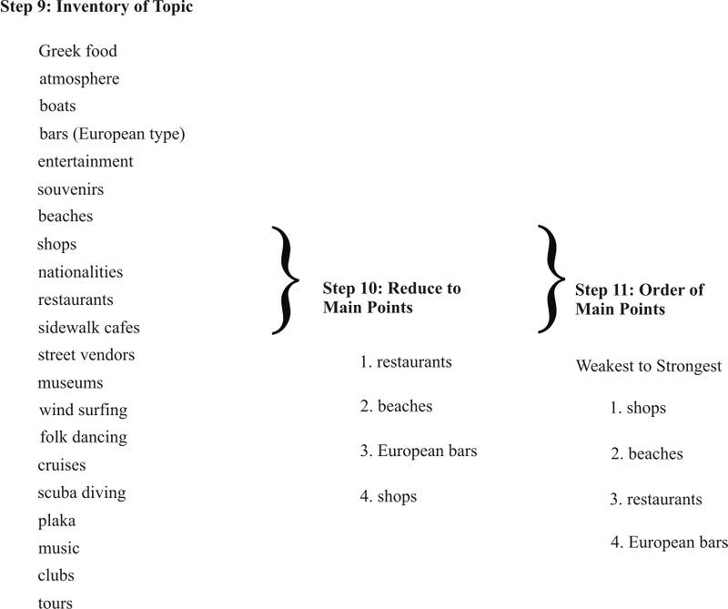
---------------

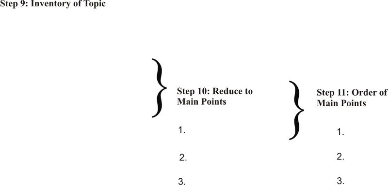
-----------------------------

_topic_ + _so what?_ + _main points_

I call this statement a basic thesis because it is your essay in a nutshell. From it you have your direction, argument, organization, and target audience. Although the basic thesis appears rigid, it forces you to examine the skeleton of your paper. Stating the thesis in a single sentence is a valuable skill. If you cannot condense what you want to say into one sentence, you do not know what you want to say about the topic.

When you can actually put your topic and points on paper, you will begin to form a plan for your essay. A single sentence eliminates the problem of a thesis going in two different directions. If you state your thesis in a _compound sentence_ (two independent clauses), you will find yourself coming to a fork in the road, and the paper will go two directions, e.g., _Glyfada is a good place to visit, and people like to buy property there_. Does the writer want to talk about Glyfada being a good vacation spot, or does the writer want to discuss real estate? In this example, the writer has two topics.

Another problem to be aware of is _parallelism_. You must keep your main points parallel as you list them in the basic thesis. For example, you must keep the words of your main points concrete (something you touch like a ball) or abstract (something you cannot touch like sadness or happiness). You must keep your main points in the same grammatical construction (singing, running, swimming; not singing, running, and to swim). Lastly, you must be consistent in the concepts you use (apples, oranges, and bananas; not apples, oranges, and zebras).

Our military members needed to be able to say, “Glyfada is a good place to visit because the prices and the climate are outstanding for shops, beaches, bars, and restaurants.” When they set up their formula, they knew they could write an essay that would fly.

Example:

**_Step 12: Basic Working Thesis_**

topic + so what? + main points.

Glyfada is a reasonably priced vacation spot that offers a variety of shops, beautiful beaches, quality restaurants, and European bars.

Review Question
---------------

**_Step 12: Basic Working Thesis_**

topic + so what? + main points.

\_\_\_\_\_\_\_\_\_\_\_\_\_\_\_\_\_\_\_\_\_\_\_\_\_\_\_\_\_\_\_\_\_\_\_\_\_\_\_\_\_\_\_\_\_\_\_\_

\_\_\_\_\_\_\_\_\_\_\_\_\_\_\_\_\_\_\_\_\_\_\_\_\_\_\_\_\_\_\_\_\_\_\_\_\_\_\_\_\_\_\_\_\_\_\_\_

Step 13: Mapping
----------------

**_Step 13: Mapping_**

Inventory each main point.

1. shops

gold

wool

ceramics

souvenirs

marble

brass

rugs

2. beaches

sand

clean

skiing

wind surf

boats

weather

scuba diving

3. restaurants

cafes

snack shops

price ranges

ethnic food

peasant type

seafood

souflaki

moussaki

4. European bars

music

folk dancing

gathering spots

atmosphere

family

open air

music

clubs

Review Question
---------------

**_Step 13: Mapping_**

Inventory each main point.

1.  \_\_\_\_\_\_\_\_\_
2.  \_\_\_\_\_\_\_\_\_
3.  \_\_\_\_\_\_\_\_\_
4.  \_\_\_\_\_\_\_\_\_

Step 14: Sub-Points
-------------------

Determine how many sub-points you need to develop each main point. Remember the outlining rule: when you have an “a,” you must have a “b.” You may have a “c,” “d,” and more, depending on how many paragraphs you want for that main point.

If you write your essay without going through the steps of this method, you may put in several frustrating hours on a draft before realizing you do not have a clear plan for writing the paper.

Example:

**_Step 14: Sub-Points_**

From the list under mapping, determine your sub-points. Each sub-point will be developed into a paragraph.

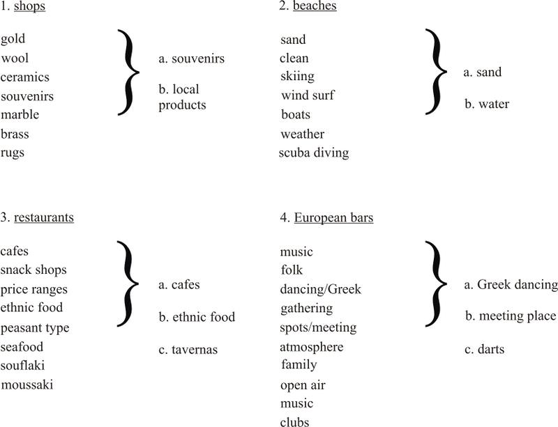
---------------

From the list under mapping, determine your sub-points. Each sub-point will be developed into a paragraph.

")
----------------------------------

Your worksheets will tell you whether you are doing the proper amount of planning and whether you understand the writing process. The worksheet also prevents you from spending time on an essay that may be disorganized or incoherent. If you cannot find enough supporting details for your main points, you will not be able to develop your essay satisfactorily.

Example:

Complete the sorting step.

**_Step 15: Sorting (Working Outline)_**

I. Introduction

A. General statement

B. So what

C. Working thesis (Glyfada is a reasonably priced vacation spot that offers a variety of shops, beautiful beaches, quality restaurants, and European bars.)

II. Shops

A. Souvenirs

B. Local products

III. Beaches/Activities

A. Sand

B. Water

IV. Restaurants

A. Cafes

B. Ethnic food

C. Tavernas

V. European bars

A. Greek dancing

B. Meeting place (family/friends)

C. Darts

VI. Final paragraph

A. Restate main points if desired

B. Concluding/pulling together

C. Universal/so what statement

Review Question
---------------

**_Step 15: Sorting (Working Outline)_**

I. Introduction

A. General statement

B. So what?

C. Working thesis (state it)

II. First Main Point

A. Sub-point

B. Sub-point

III. Second Main Point

A. Sub-point

B. Sub-point

IV. Third Main Point

A. Sub-point

B. Sub-point

C. Sub-point

V. Fourth Main Point (if needed)

A. Sub-point

B. Sub-point

C. Sub-point

VI. Final paragraph

A. Restate main points if desired

B. Concluding/pulling together

C. Universal/so what statement

Step 16: Composition
--------------------

Follow these rules when you write your essay.

2.  Do not change the main point “key word” the first time you use it in the body of the paper. Keep it the same as it was in the basic thesis. If you use the word “warehouse” in the basic working thesis, do not switch to “discount stores” when you introduce that main point. You may use a similar term within the paragraph, but not in the first sentence.
3.  In the body of the essay (not the introduction or conclusion), you must have this formula at the beginning of paragraphs: transition + main point + sub-point.
4.  You need glue to hold parts together. Glue creates coherence, or clarity, in your essay. You create coherence (glue) in three ways:
    1.  Using a transition word. See the sheet of transitions at the end of this chapter.
    2.  Repeating the previous main point or sub-point.
    3.  Repeating a key word you have been using in the previous paragraph.

1.  Underline the basic thesis in the introductory paragraph.
2.  Place a wavy line under each transition. Starting with paragraph two, you must have one transition at the beginning of every paragraph. You should have several within the paragraph. See the list of transitions attached to the end of this chapter.
3.  In the body of the essay (not the introduction or conclusion), circle the main points at beginning of each paragraph. They must be in the same order as they are in your basic thesis. Remember that the first time you use the main point, it must be the same word you used in the basic thesis.
4.  After you have circled the main point at the beginning of a paragraph, place a square around the sub-point at the beginning of that paragraph.
5.  Some type of summary or conclusion needs to be stated either in a final sentence or a final paragraph. This pulling together of ideas can be done by a variety of methods: restating key words, summarizing major ideas, or making a concluding statement. The important thing is that the beginning is brought full circle to conclude the topic.

|     |     |
| --- | --- |Title of Essay
| **Topic Sentence** | **Example** |
| --- | --- |
| $\P$ 1. Introduction. General to specific. Include the “so what?”. Place the working thesis with main points at the end of intro paragraph. | _\[Write the full introduction after you have written the body and conclusion.\]_ |
| $\P$ 2. Glue + main point 1 (shops). Begin sub-point (souvenirs) with support. | To begin, Glyfada has some of the best shops in Greece. They offer a wide variety of inexpensive souvenirs... _\[Provide examples.\]_ |
| $\P$ 3. Glue + main point 1 (shops) plus sub-point (local products). | Besides shops with unique souvenirs, the visitor can find many local products. |
| $\P$ 4. Glue + main point 2 (beaches). Begin sub-point (activities for sand). | In addition to shops, the beaches in Glyfada are attractive. They offer many activities on sand. |
| $\P$ 5. Glue + main point 2 (beaches) plus another sub-point (water sports). | Beaches also offer all water sports. |
| $\P$ 6. Glue + main point 3 (restaurants) plus sub-point (sidewalk cafes). | Third, restaurants in Glyfada boast excellent food, especially in sidewalk cafes. |
| $\P$ 7. Glue + main point 3 (restaurants) plus another sub-point (gourmet/ethnic). | Also, ethnic restaurants in Glyfada offer excellent choices. |
| $\P$ 8. Glue + main point 3 (restaurants) plus sub-point (tavernas). | Another restaurant, the taverna, caters to families and friends dining informally. |
| $\P$ 9. Glue + main point 4 (European bars). Begin sub-point (Greek dancing). | We have discussed the available shops, beaches, and restaurants, but what will be most enticing will be the European bars. They offer a taste of local traditions such as traditional Greek dancing. |
| $\P$ 10. Glue + main point 4 (European bars) plus sub-point (meeting place). | European bars are also meeting places for friends new and old. |
| $\P$ 11. Glue + main point 4 (European bars) plus sub-point (darts). | Besides a place for Greek dancing and meeting friends, European bars also offer recreational and competitive dart games. |
| $\P$ 12. Final paragraph. | Restate key words, summarize major ideas, or make a concluding statement. |

The final steps are focused on editing and revision.

**Step 16: Peer Response.** Read your essay for content, organization, coherence, and unity. Have a friend read your essay and respond.

**Step 17: Revision 1.**

**Step 18: Editing Session.** Refine (diction, syntax, spelling, punctuation, etc.). Read your essay aloud to a friend or yourself. Have someone read it to you.

**Step 19: Revision 2.**

**Step 20: Final Draft for Grading.**

The Glyfada Method makes you a confident writer. It also helps you avoid the temptation of plagiarizing. You will have a plan to guide you through the writing stages, and you will not use someone’s else’s work.

**Student Worksheet**

**Step 1: Heuristics**

mother’s death, divorce, PhD exam, $1^{st}$ degree black belt test, tennis tournament loss

**Step 2: Topic and Focus**

black belt test/challenge

**Step 3: Target Audience**

anyone interested in trying martial arts; anyone trying to overcome an obstacle

**Step 4: So What?**

challenge can be met even when we think it’s impossible

**Step 5: Organization**

logical for persuasion

**Step 6: Appeal**

pathos; appealing to determination and self-esteem

**Step 7: Development**

Examples, diagrams, facts, illustrations examples from martial arts class, details of testing, antidotes

**Step 8: Probable Topic** (educated guess)

Testing for black belt made me grow in character.

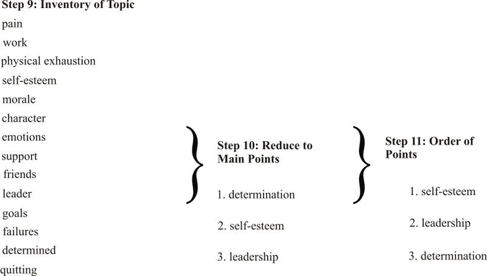

**Step 13: Mapping**. Inventory each main point. Each sub-point will be developed into a paragraph.

**")

I. Introduction

A. General statement

B. So what

C. Working thesis

II. Self-Esteem

A. Success

B. Accomplishments

III. Leadership

A. Decisions

B. Confidence

IV. Determination

A. Attitude

B. Focus

C. Spirit

V. Final paragraph

A. Restate main points if desired

B. Concluding/pulling together

C. Universal/so what statement

**Step 16: The Composition**

|     |     |
| --- | --- |Title of Essay
| **Topic Sentence** | **Example of topic sentences** |
| --- | --- |
| $\P$ 1. Introduction. General to specific. Include the “so what?”. Place the working thesis with main points at the end of intro paragraph. | _\[Write the full introduction after you have written the body and conclusion.\]_ |
| $\P$ 2. Glue + main point 1 (Self-esteem) + sub-point (Success) + with support. | First, my self esteem improved when I experienced success during the test. _\[Provide examples.\]_ |
| $\P$ 3. Glue + main point 1 (self-esteem) + sub-point (pride). | My self esteem also improved because I took pride in what I accomplished. _\[Provide examples.\]_ |
| $\P$ 4. Glue + main point 2 (leadership) + sub-point (decisions). | Besides building self-esteem, I developed stronger leadership skills when I had to make decisions for my group. _\[Provide examples.\]_ |
| $\P$ 5. Glue + main point 2 (leadership) + sub-point (strength). | Additionally, I learned to be a leader by staying strong. _\[Provide examples.\]_ |
| $\P$ 6. Glue + main point 3 (determination) + sub-point (attitude). | The third thing I learned was to have determination by keeping a positive attitude. _\[Provide examples.\]_ |
| $\P$ 7. Glue + main point 3 (determination) + sub-point (focus). | Another way I kept my determination was to keep my focus. _\[Provide examples.\]_ |
| $\P$ 8. Glue + main point 3 (determination) + sub-point (spirit). | Furthermore, I stayed determined in spirit. |
| $\P$ 9. Final paragraph. | Recap main points—what experience meant to you. |

Worksheet for The Glyfada Method

**Heuristics:** \_\_\_\_\_\_\_\_\_\_\_\_\_\_\_\_\_\_\_\_\_\_\_\_\_\_\_\_\_\_\_\_\_\_\_\_\_\_\_\_

**Topic/Focus:** \_\_\_\_\_\_\_\_\_\_\_\_\_\_\_\_\_\_\_\_\_\_\_\_\_\_\_\_\_\_\_\_\_\_\_\_\_\_\_\_

**Target Audience:** \_\_\_\_\_\_\_\_\_\_\_\_\_\_\_\_\_\_\_\_\_\_\_\_\_\_\_\_\_\_\_\_\_\_\_\_\_\_\_\_

**So what?:** \_\_\_\_\_\_\_\_\_\_\_\_\_\_\_\_\_\_\_\_\_\_\_\_\_\_\_\_\_\_\_\_\_\_\_\_\_\_\_\_

**Organization:** \_\_\_\_\_\_\_\_\_\_\_\_\_\_\_\_\_\_\_\_\_\_\_\_\_\_\_\_\_\_\_\_\_\_\_\_\_\_\_\_

**Appeals (Logos, Pathos, Ethos):** \_\_\_\_\_\_\_\_\_\_\_\_\_\_\_\_\_\_\_\_\_\_\_\_\_\_\_\_

**Development:** \_\_\_\_\_\_\_\_\_\_\_\_\_\_\_\_\_\_\_\_\_\_\_\_\_\_\_\_\_\_\_\_\_\_\_\_\_\_\_\_

**Probable Topic:** \_\_\_\_\_\_\_\_\_\_\_\_\_\_\_\_\_\_\_\_\_\_\_\_\_\_\_\_\_\_\_\_\_\_\_\_\_

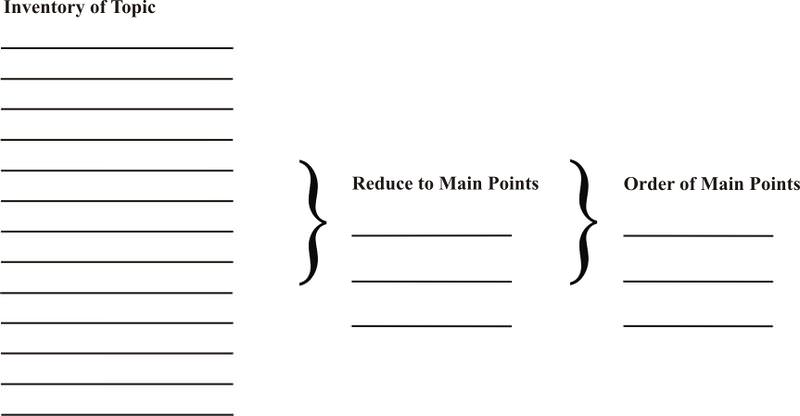

\_\_\_\_\_\_\_\_\_\_\_\_\_\_\_\_\_\_\_\_\_\_\_\_\_\_\_\_\_\_\_\_\_\_\_\_\_\_\_\_\_\_\_\_\_\_\_\_\_\_

\_\_\_\_\_\_\_\_\_\_\_\_\_\_\_\_\_\_\_\_\_\_\_\_\_\_\_\_\_\_\_\_\_\_\_\_\_\_\_\_\_\_\_\_\_\_\_\_\_\_

**Mapping: Main Points and Sub-Points**

:**")

I. Introduction

A. General statement

B. So what?

C. Working thesis

II. First Main Point

A. Sub-point

B. Sub-point

III. Second Main Point

A. Sub-point

B. Sub-point

IV. Third Main Point

A. Sub-point

B. Sub-point

C. Sub-point

V. Fourth Main Point (your choice)

A. Sub-point

B. Sub-point

C. Sub-point

VI. Final paragraph

A. Restate main points if desired

B. Concluding/pulling together

C. Universal/so what statement

**Transition Words**

To Relate Thoughts:

indeed - implicit in that statement

anyway - from all information

anyhow - at best

elsewhere - naturally

nearby - in the broader sense

above all - to this end

even these - on balance

beyond - the heart of the matter

in other words - in fact

for instance - as a routine matter

of course - notwithstanding

in short - nonetheless

in sum - as a general rule

yet, what accounts for this - understandably

in reality - the reason, of course

that is - but there is a sense

the lesson here is

To Show Results:

therefore - so

as a result - consequently

thus - hence

as - due to

because - since

because of - accordingly

To Add Ideas:

first, second, next, last - to all that

in addition - the answer does not only lie

additionally - also

moreover - more than anything else

furthermore - here are some ... facts

another - now, of course, there are

besides - now, however

too

To Show Time:

immediately - this year; however

presently - later

nearly a . . . later - then

meanwhile - last year

in the meantime - tomorrow

afterward - soon

after - during

next - eventually

as of today - as of now

previously - initially

subsequently - lastly

finally

To Compare Ideas:

like - similar

just as - this

in comparison - in contrast

likewise - whereas

Additional Sources
------------------

For more information on the three appeals, go to this website: http://www.calstatela.edu/faculty/jgarret/3waypers.htm.

For more information on **_invention_** in classical rhetoric, go to http://web.cn.edu/KWHEELER/inventio.html

</article>

